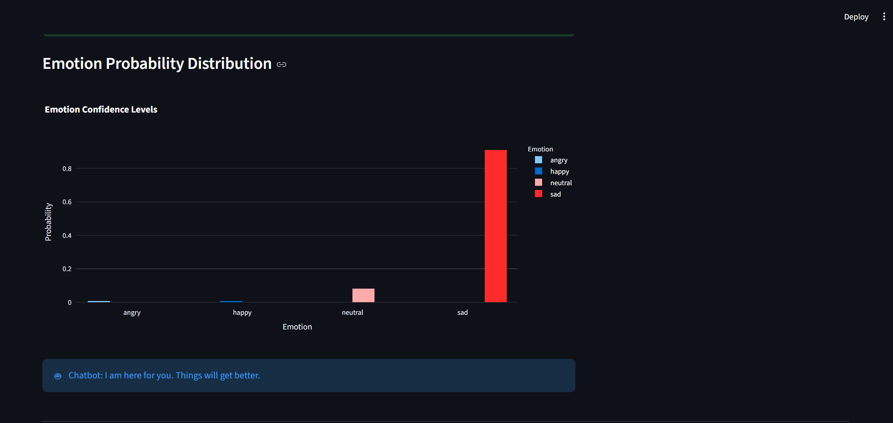
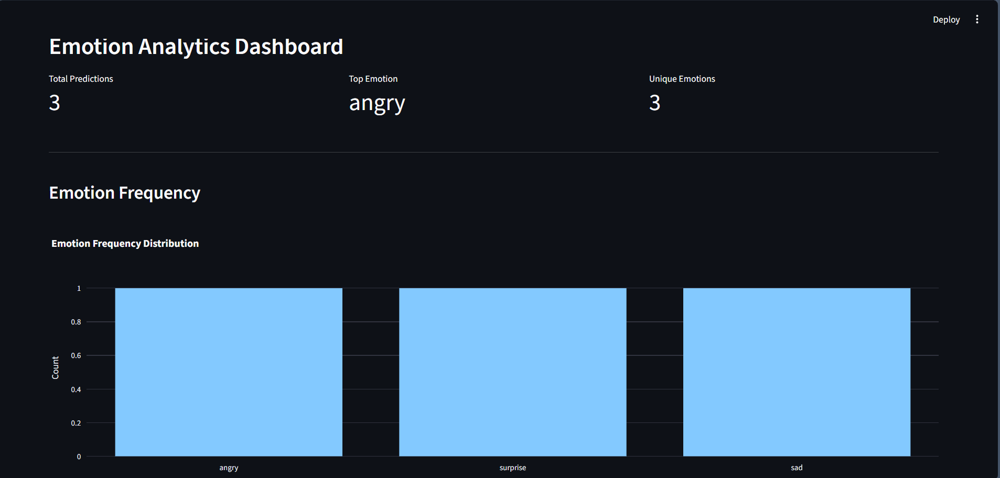
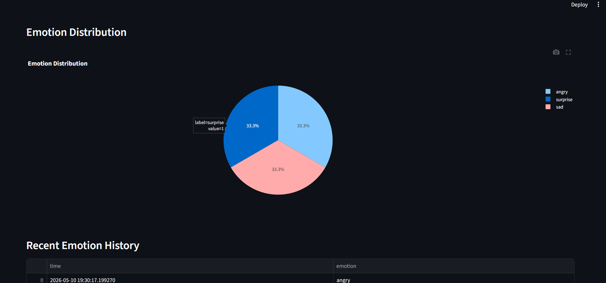

# 🧠 AI Multimodal Emotion Recognition System

## 📌 Overview

This project is a real-time AI-based multimodal emotion recognition system that detects human emotions using:

- 🎤 Voice Tone Analysis
- 😀 Facial Expression Recognition

The system combines speech emotion recognition and facial emotion detection to improve prediction robustness and accuracy.

It uses Deep Learning techniques including CNN + LSTM for speech analysis and DeepFace for facial emotion recognition.

---

# 🚀 Features

✅ Real-time Voice Emotion Detection  
✅ Facial Emotion Recognition using Webcam  
✅ CNN + LSTM Deep Learning Model  
✅ MFCC Audio Feature Extraction  
✅ DeepFace + OpenCV Face Analysis  
✅ Multimodal Emotion Fusion  
✅ Interactive Streamlit Dashboard  
✅ Emotion Probability Visualization  
✅ Emotion Analytics Dashboard  
✅ Emotion-aware Chatbot  
✅ Emotion History Tracking  

---

# 🧠 Technologies Used

- Python
- TensorFlow / Keras
- CNN + LSTM
- DeepFace
- OpenCV
- Streamlit
- Plotly
- NumPy
- Pandas
- Librosa
- Scikit-learn

---

# 🏗️ System Architecture

## 🎤 Speech Emotion Recognition

### Audio Processing Pipeline
- Audio Recording
- MFCC Feature Extraction
- Sequence Padding
- CNN + LSTM Model Prediction

### Model
- 1D CNN Layers
- LSTM Layers
- Dense Neural Network
- Softmax Emotion Classification

---

## 😀 Facial Emotion Recognition

- Webcam Image Capture
- Face Detection using OpenCV
- Emotion Analysis using DeepFace

---

## 🔀 Multimodal Fusion

The final emotion prediction is generated by combining:

- Voice Emotion
- Facial Emotion
- Confidence Scores

---

# 📊 Model Performance

| Model | Accuracy |
|---|---|
| CNN + LSTM Speech Emotion Model | 71% |

---

# 📁 Dataset

Dataset Used:
- RAVDESS Emotional Speech Dataset

Dataset contains emotional speech audio samples for:
- Angry
- Happy
- Sad
- Neutral
- Fear
- Surprise

---

# 📂 Project Structure

```bash
SpeechEmotionRecognition/
│
├── app/
│   ├── app.py
│   ├── chatbot.py
│   ├── dashboard.py
│   └── face_emotion.py
│
├── models/
│
├── utils/
│   └── feature_extraction.py
│
├── screenshots/
│
├── README.md
├── requirements.txt
├── prepare_dataset.py
├── train_model.py
└── emotion_history.csv
```

---

# ⚙️ Installation

## 1️⃣ Clone Repository

```bash
git clone https://github.com/gayatri9911/multimodal-emotion-recognition.git
```

---

## 2️⃣ Open Project Folder

```bash
cd multimodal-emotion-recognition
```

---

## 3️⃣ Install Dependencies

```bash
pip install -r requirements.txt
```

---

# ▶️ Run Application

Go inside app folder:

```bash
cd app
```

Run Streamlit app:

```bash
streamlit run app.py
```

---

# 📸 Screenshots

## 🔹 Main Dashboard


---

## 🔹 Emotion Probability Distribution



---

## 🔹 Analytics Dashboard



---

## 🔹 Emotion Distribution



---

# 📈 Future Improvements

- Real-time continuous emotion tracking
- Improved multimodal fusion
- Transformer-based speech models
- Spectrogram-based CNN models
- Cloud deployment
- Live emotion timeline visualization
- Better real-world noise handling

---

# 👩‍💻 Author

**Gayatri Tarhekar**

---

# ⭐ GitHub Repository

If you found this project interesting, feel free to star the repository ⭐